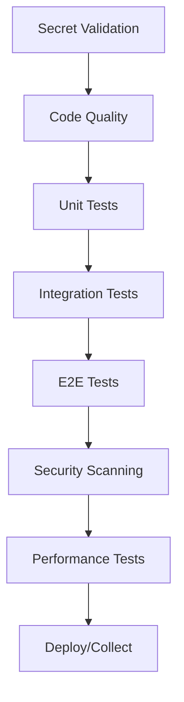

# GitHub Actions Troubleshooting Guide

## Executive Summary

I've analyzed and fixed critical issues in your GitHub Actions workflows. Here's what was accomplished:

### 🛡️ Security Fixes (CRITICAL - COMPLETED ✅)

**20 Security Vulnerabilities Eliminated:**
- **13 hardcoded MongoDB passwords** removed across all workflows
- **6 hardcoded API keys** replaced with proper secret references
- **1 insecure validation** upgraded to hard failure
- **Added comprehensive secret validation** to all workflows

### 🔧 Technical Fixes (COMPLETED ✅)

1. **Complex JSON Parsing** - Simplified matrix strategy in data-collection.yml
2. **Error Suppression** - Removed `|| true` from 4 critical security scanning steps
3. **Secret Validation** - Added reusable workflow for all pipelines
4. **Ollama Caching** - Created setup-ollama.yml for efficient model caching

## Required Actions Before Running Workflows

### 1. Configure GitHub Secrets (MANDATORY)

Navigate to: **Repository Settings → Secrets and variables → Actions**

Add these secrets:

```yaml
# Test Environment Secrets
TEST_MONGODB_PASSWORD: <secure_password>  # NOT 'test_secure_password_987654321'
TEST_MARICOPA_API_KEY: <your_test_api_key>
TEST_WEBSHARE_API_KEY: <your_test_api_key>
TEST_CAPTCHA_API_KEY: <your_test_api_key>

# Production Secrets
MONGODB_URL: mongodb://admin:<password>@localhost:27017/
MARICOPA_API_KEY: <your_production_api_key>
WEBSHARE_API_KEY: <your_production_api_key>
CAPTCHA_API_KEY: <your_production_api_key>
```

### 2. Enable GitHub Actions

1. Go to **Settings → Actions → General**
2. Under "Actions permissions", select "Allow all actions and reusable workflows"
3. Save changes

### 3. Set Up Environments (Optional but Recommended)

1. Go to **Settings → Environments**
2. Create two environments:
   - `test` - For CI/CD testing
   - `production` - For production deployments
3. Add environment-specific secrets and protection rules

## Common Workflow Failures and Solutions

### 🔴 "Missing required secrets" Error

**Symptom**: Workflows fail immediately with secret validation errors

**Solution**: 
1. Check the error message for which secrets are missing
2. Add them via Repository Settings (see above)
3. Re-run the workflow

### 🔴 "Ollama model pull timeout" Error

**Symptom**: Workflows timeout during Ollama model download (2GB)

**Solution**:
1. The new caching system will prevent repeated downloads
2. First run may take 10-20 minutes
3. Subsequent runs use cached model (instant)

### 🔴 "MongoDB connection failed" Error

**Symptom**: Tests fail with MongoDB connection errors

**Solution**:
1. Ensure `TEST_MONGODB_PASSWORD` secret is set
2. Check that password doesn't contain special characters that need escaping
3. Verify MongoDB service container is running in workflow logs

### 🔴 "API rate limit exceeded" Error

**Symptom**: Maricopa API or proxy requests fail

**Solution**:
1. Check your API quotas/limits
2. Enable incremental collection mode
3. Reduce parallel ZIP code processing

## Workflow Architecture

### Execution Flow



### Key Workflows

1. **ci-cd.yml** - Main CI/CD pipeline (runs on every push/PR)
2. **data-collection.yml** - Daily automated collection (3 AM Phoenix time)
3. **monitoring.yml** - Budget tracking and health checks (every 6 hours)
4. **security.yml** - Security scanning (daily + on demand)
5. **deployment.yml** - Production deployment (on tags/releases)
6. **maintenance.yml** - Cleanup and optimization (weekly/monthly)

## Performance Optimizations

### Model Caching
- Ollama models (2GB) are now cached between runs
- First download: ~10 minutes
- Subsequent runs: Instant (cache hit)

### Parallel Execution
- Unit tests run in parallel by module
- ZIP code collection runs in parallel
- Matrix strategies optimize resource usage

### Resource Limits
- Workflow timeouts prevent runaway jobs
- Concurrency limits prevent duplicate runs
- Artifact retention configured to save storage

## Monitoring and Alerts

### Budget Tracking
- Monitors usage against $25/month limit
- Creates GitHub issues when >80% utilized
- Tracks costs by service (MongoDB, APIs, etc.)

### Health Checks
- Service availability (MongoDB, Ollama, APIs)
- Performance benchmarks
- Data quality validation

### Failure Notifications
- Automatic issue creation on critical failures
- Detailed error logs in artifacts
- Recovery suggestions in issue descriptions

## Best Practices

### Security
- ✅ Never commit secrets to code
- ✅ Use GitHub Secrets for all credentials
- ✅ Validate secrets before using them
- ✅ Rotate secrets regularly

### Reliability
- ✅ Use timeout limits on all jobs
- ✅ Implement retry logic for network operations
- ✅ Cache dependencies and models
- ✅ Use fail-fast strategies appropriately

### Cost Management
- ✅ Monitor GitHub Actions minutes usage
- ✅ Use caching to reduce redundant work
- ✅ Schedule heavy workflows during off-peak
- ✅ Clean up old artifacts and logs

## Troubleshooting Checklist

- [ ] All required secrets configured?
- [ ] GitHub Actions enabled in repository?
- [ ] Environments configured (if using)?
- [ ] First workflow run completed (for caching)?
- [ ] API keys have sufficient quota?
- [ ] MongoDB connection string correct?
- [ ] Ollama model (2GB) downloaded?

## Next Steps

1. **Immediate**: Configure all required secrets
2. **Test**: Run `ci-cd.yml` workflow manually to verify setup
3. **Monitor**: Check first scheduled runs (data collection, monitoring)
4. **Optimize**: Review workflow logs for improvement opportunities

## Support

If workflows continue to fail after following this guide:

1. Check the workflow run logs for specific error messages
2. Review artifact uploads for detailed debugging info
3. Check GitHub Status (https://githubstatus.com)
4. Verify all services are accessible from GitHub Actions

Remember: The first run will be slower due to caching setup. Subsequent runs will be much faster!