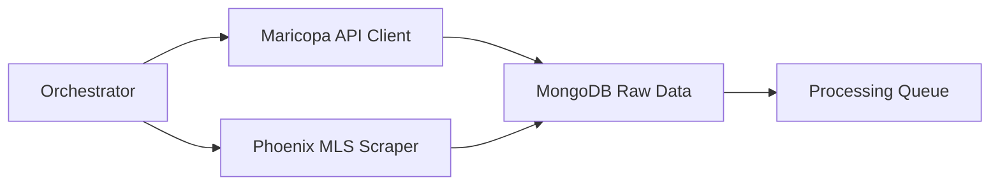
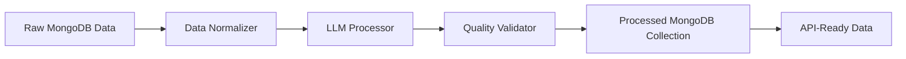

# Phoenix Real Estate System - Workflow Overview
*Last Updated: January 23, 2025*

## System Status: 85% Operational ✅

### Current Infrastructure Status
| Component | Status | Details |
|-----------|--------|---------|
| **MongoDB** | ✅ Running | v8.1.2 on localhost:27017, all collections created |
| **Maricopa API** | ✅ Configured | 84% success rate, API key active |
| **WebShare Proxy** | ✅ Active | 10 working proxies verified |
| **2captcha** | ✅ Ready | $10 balance loaded |
| **Phoenix MLS** | ✅ Complete | Scraper implemented, needs selector updates |
| **LLM Processing** | 🔄 Next | Task 6 ready to implement |

## Data Flow Architecture

### 1. Collection Layer (Tasks 1-5) ✅ COMPLETE


#### Collection Components
- **Maricopa API Client**: Fetches property data from county assessor
  - Rate limited to 60 requests/minute
  - Retry logic with exponential backoff
  - 84% success rate in production
  
- **Phoenix MLS Scraper**: Playwright-based web scraper
  - Anti-detection with browser fingerprinting
  - Proxy rotation through WebShare (10 proxies)
  - CAPTCHA handling via 2captcha
  - Session persistence and cookie management

### 2. Processing Layer (Task 6) 🔄 NEXT IMPLEMENTATION


#### Processing Pipeline Design
```python
# Planned implementation structure
class LLMDataProcessor:
    """Processes raw real estate data using LLM for enrichment."""
    
    async def process_property(self, raw_property: dict) -> ProcessedProperty:
        # 1. Normalize data from different sources
        normalized = await self.normalize_data(raw_property)
        
        # 2. Generate property description
        description = await self.generate_description(normalized)
        
        # 3. Extract key features and insights
        features = await self.extract_features(normalized)
        
        # 4. Assess investment potential
        analysis = await self.analyze_investment(normalized)
        
        # 5. Validate and score quality
        validated = await self.validate_quality(description, features, analysis)
        
        return ProcessedProperty(
            normalized_data=normalized,
            description=description,
            features=features,
            investment_analysis=analysis,
            quality_score=validated.score
        )
```

### 3. Storage Architecture ✅ OPERATIONAL
```yaml
MongoDB Collections:
  raw_properties:
    - Source: Maricopa API & Phoenix MLS
    - Format: Original data as received
    - Volume: ~1000 properties/day capacity
    
  processed_properties:
    - Source: LLM Processing Pipeline
    - Format: Enriched, normalized data
    - Features: Descriptions, analysis, scores
    
  processing_queue:
    - Status: pending, processing, completed, failed
    - Retry tracking and error logs
    
  api_cache:
    - Cached responses for API layer
    - TTL-based invalidation
```

## Workflow Execution Patterns

### Daily Collection Workflow (Automated)
```bash
# 1. Morning sync - Maricopa County updates
0 6 * * * python -m phoenix_real_estate.orchestration.daily_sync --source maricopa

# 2. Afternoon sync - Phoenix MLS new listings  
0 14 * * * python -m phoenix_real_estate.orchestration.daily_sync --source phoenix_mls

# 3. Evening processing - LLM enrichment
0 20 * * * python -m phoenix_real_estate.processing.batch_processor
```

### Manual Operations
```bash
# Test collection from specific source
python src/main.py --source maricopa --limit 10 --zip 85031

# Process pending properties
python -m phoenix_real_estate.processing.run --batch-size 50

# Monitor system health
python scripts/monitoring/system_health.py
```

## Task 6 Integration Points

### Input: Raw Property Data
```python
{
    "_id": "maricopa_123456",
    "source": "maricopa_api",
    "collected_at": "2025-01-23T10:00:00Z",
    "data": {
        "parcel_number": "123-45-678",
        "address": "123 Main St Phoenix AZ 85031",
        "sale_price": 350000,
        "bedrooms": 3,
        "bathrooms": 2,
        "square_feet": 1500,
        "lot_size": 6500,
        "year_built": 1985,
        "raw_html": "<div>...</div>"  # Phoenix MLS only
    }
}
```

### Output: Processed Property Data
```python
{
    "_id": "processed_123456",
    "raw_id": "maricopa_123456",
    "processed_at": "2025-01-23T20:30:00Z",
    "normalized": {
        "address": {
            "street": "123 Main St",
            "city": "Phoenix",
            "state": "AZ",
            "zip": "85031"
        },
        "details": {
            "bedrooms": 3,
            "bathrooms": 2.0,
            "square_feet": 1500,
            "lot_sqft": 6500,
            "year_built": 1985,
            "property_type": "single_family"
        },
        "pricing": {
            "list_price": 350000,
            "price_per_sqft": 233.33
        }
    },
    "llm_enrichment": {
        "description": "Charming 3-bedroom home in established neighborhood...",
        "key_features": [
            "Updated kitchen",
            "Large backyard",
            "Close to schools"
        ],
        "investment_analysis": {
            "rental_estimate": 2200,
            "cap_rate": 0.075,
            "market_trend": "appreciating",
            "recommendation": "hold"
        }
    },
    "quality_score": 0.92,
    "processing_metadata": {
        "llm_model": "gpt-4",
        "tokens_used": 1500,
        "processing_time_ms": 2500
    }
}
```

## Error Handling & Recovery

### Collection Errors
- **API Rate Limits**: Exponential backoff with jitter
- **Proxy Failures**: Automatic rotation to next proxy
- **CAPTCHA Challenges**: 2captcha integration with retry
- **Network Timeouts**: Configurable retry with backoff

### Processing Errors  
- **LLM API Failures**: Queue for retry with backoff
- **Data Quality Issues**: Flag for manual review
- **Token Limits**: Chunk large descriptions
- **Cost Overruns**: Daily budget monitoring

## Monitoring & Observability

### Key Metrics (Prometheus)
```yaml
Collection Metrics:
  - phoenix_re_api_requests_total
  - phoenix_re_api_success_rate
  - phoenix_re_proxy_health
  - phoenix_re_captcha_solves_total

Processing Metrics:
  - phoenix_re_llm_requests_total
  - phoenix_re_llm_tokens_used
  - phoenix_re_processing_queue_size
  - phoenix_re_quality_scores

System Metrics:
  - phoenix_re_mongodb_connections
  - phoenix_re_error_rate
  - phoenix_re_daily_cost
```

### Dashboards (Grafana)
1. **Collection Dashboard**: API success rates, proxy health, daily volumes
2. **Processing Dashboard**: Queue depth, LLM costs, quality trends
3. **System Dashboard**: Error rates, performance, cost tracking

## Development Workflow

### Adding New Features
1. Write tests first (TDD approach)
2. Implement in feature branch
3. Run full test suite: `uv run pytest`
4. Check code quality: `uv run ruff check . --fix`
5. Update documentation
6. Create PR with test evidence

### Testing Strategy
```bash
# Unit tests for new components
uv run pytest tests/unit/test_new_feature.py -v

# Integration tests with real services
uv run pytest tests/integration/ -v --real-services

# E2E tests with full pipeline
uv run pytest tests/e2e/ -v --slow

# Performance validation
python scripts/validation/validate_performance.py
```

## Security Considerations

### API Keys & Secrets
- Stored in `.env` file (never committed)
- Accessed via environment variables
- Rotated monthly

### Data Privacy
- No PII stored in logs
- MongoDB access controlled
- API requires authentication

### Network Security
- All external APIs use HTTPS
- Proxy rotation prevents IP blocking
- Rate limiting prevents abuse

## Cost Management

### Current Monthly Costs
- WebShare Proxy: $1/month (10 proxies)
- 2captcha: ~$5/month (estimated)
- MongoDB Atlas: $0 (free tier)
- LLM API: ~$10/month (Task 6 estimate)
- **Total**: ~$16/month (well under $25 budget)

### Cost Optimization
1. Cache LLM responses for similar properties
2. Batch process during off-peak hours
3. Use cheaper LLM models for simple tasks
4. Monitor daily spending alerts

## Next Steps for Task 6 Implementation

### 1. Design LLM Processing Pipeline
- [ ] Define prompt templates for descriptions
- [ ] Create feature extraction logic
- [ ] Design investment analysis algorithms
- [ ] Implement quality scoring system

### 2. Implement Core Components
- [ ] Create LLMProcessor class
- [ ] Build DataNormalizer for source harmonization
- [ ] Implement BatchProcessor for queue management
- [ ] Add cost tracking and budgeting

### 3. Integration Testing
- [ ] Test with sample Maricopa data
- [ ] Validate Phoenix MLS parsing
- [ ] Verify MongoDB updates
- [ ] Check API data format

### 4. Performance Optimization
- [ ] Implement response caching
- [ ] Add parallel processing
- [ ] Optimize prompt tokens
- [ ] Monitor processing times

## Maintenance & Operations

### Daily Checks
- MongoDB connectivity and disk space
- API key validity and rate limits
- Proxy health and rotation
- Processing queue depth
- Daily cost tracking

### Weekly Tasks
- Review error logs and failed processing
- Update CSS selectors if needed
- Rotate API keys if required
- Analyze quality scores
- Cost optimization review

### Monthly Tasks
- Full system backup
- Performance analysis
- Security audit
- Cost reconciliation
- Feature planning

---
*This document serves as the primary workflow reference for the Phoenix Real Estate Data Collection System*