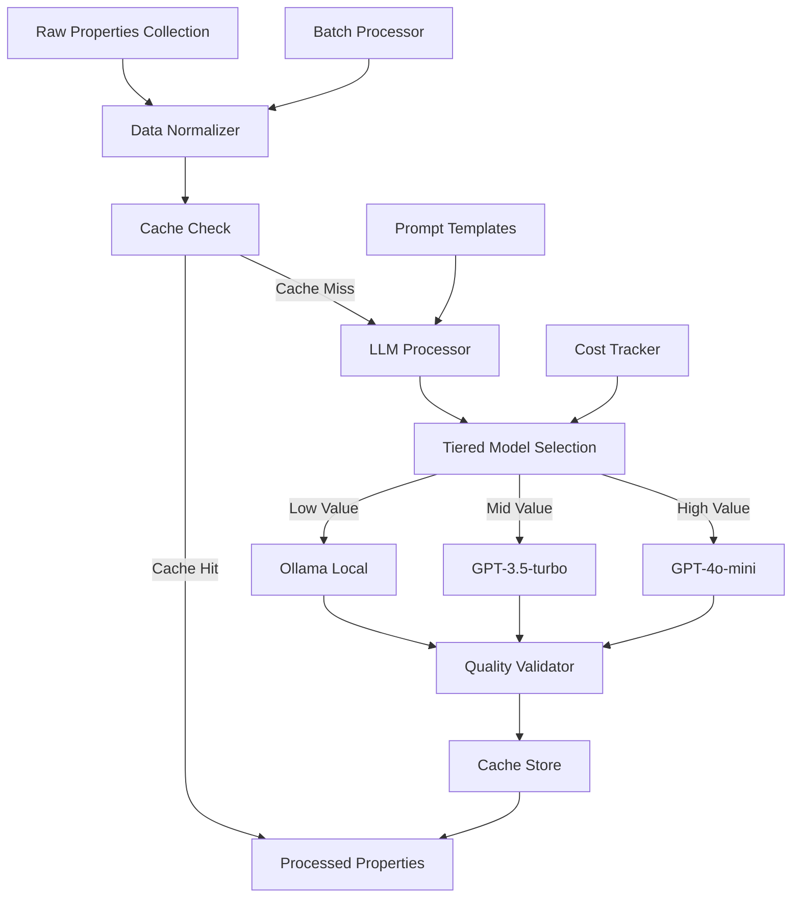

# Task 06: LLM Data Processing - Implementation Workflow
*Created: January 23, 2025*

## TDD-First Implementation Approach

### Core TDD Principles
This implementation follows strict Test-Driven Development methodology where **every component must have tests written BEFORE implementation**. This ensures quality, maintainability, and prevents regression.

#### Red-Green-Refactor Cycle
1. **RED**: Write failing tests that define expected behavior
2. **GREEN**: Write minimal code to make tests pass
3. **REFACTOR**: Improve code quality while keeping tests green

#### Time Allocation
- **30-40%** of development time for test creation
- **40-50%** for implementation
- **10-20%** for refactoring and optimization

#### Test Categories Priority
1. **Unit Tests**: Component behavior validation
2. **Integration Tests**: Component interaction verification
3. **Performance Tests**: Speed and resource benchmarks
4. **Accuracy Tests**: LLM output quality validation

### TDD Benefits for LLM Processing
- **Predictable Behavior**: LLM responses can vary; tests ensure consistency
- **Cost Control**: Tests validate budget constraints before deployment
- **Quality Assurance**: Automated validation of enrichment quality
- **Regression Prevention**: Prompt changes won't break existing functionality

## Overview
Task 6 implements the LLM processing pipeline that transforms raw property data from Maricopa API and Phoenix MLS into enriched, investment-ready information.

## Current System State
- **MongoDB**: ✅ Running with raw_properties collection populated
- **Collection Pipeline**: ✅ Operational (Tasks 1-5 complete)
- **Processing Pipeline**: 🔄 Ready to implement (Task 6)
- **Budget Available**: ~$19/month for LLM API costs ($25 total - $6 services)

## Architecture Design

### Component Structure
```
phoenix_real_estate/processors/
├── __init__.py
├── base_processor.py          # Abstract base class
├── llm/
│   ├── __init__.py
│   ├── llm_processor.py       # Main LLM integration
│   ├── providers/             # LLM provider implementations
│   │   ├── __init__.py
│   │   ├── openai_provider.py    # GPT models
│   │   ├── ollama_provider.py    # Local models
│   │   └── anthropic_provider.py # Claude (fallback)
│   └── cache_manager.py       # Redis caching layer
├── data_normalizer.py         # Source harmonization  
├── prompt_templates.py        # LLM prompt management
├── quality_validator.py       # Output validation
├── cost_tracker.py           # Budget monitoring
└── batch_processor.py        # Queue management
```

### Data Flow


## Implementation Timeline with TDD Milestones

### Overview
Each phase follows TDD methodology with test milestones preceding implementation milestones. Quality gates ensure no progression without passing tests.

### Phase 1: Data Normalization (Days 1-2)
**Day 1: Test Development (40% time)**
- Write comprehensive unit tests for DataNormalizer
- Create test fixtures for Maricopa and Phoenix MLS data formats
- Define edge case tests (missing fields, malformed addresses)
- Performance benchmark tests (< 100ms per property)

**Day 2: Implementation (60% time)**
- Implement DataNormalizer to pass all tests
- Add logging and error handling
- Refactor for clarity and performance

**Quality Gate**: 100% test coverage, all tests passing

```python
# First write the test (TDD approach)
# tests/processors/test_data_normalizer.py
@pytest.fixture
def maricopa_raw_data():
    """Sample Maricopa API response."""
    return {
        'source': 'maricopa_api',
        'data': {
            'parcel_number': '123-45-678',
            'situs_address': '123 MAIN ST PHOENIX AZ 85031',
            'sq_ft': '1500',
            'bedrooms': '3',
            'bathrooms': '2'
        }
    }

def test_normalize_maricopa_property(maricopa_raw_data):
    """Test normalization of Maricopa property data."""
    normalizer = DataNormalizer()
    result = normalizer.normalize_property(maricopa_raw_data)
    
    assert result.address.street == '123 Main St'
    assert result.address.city == 'Phoenix'
    assert result.square_feet == 1500
    assert result.bedrooms == 3

# Then implement the code to pass the test
class DataNormalizer:
    """Normalizes property data from various sources."""
    
    def normalize_property(self, raw_data: dict) -> NormalizedProperty:
        """Convert raw data to standardized format."""
        source = raw_data.get('source')
        
        if source == 'maricopa_api':
            return self._normalize_maricopa(raw_data)
        elif source == 'phoenix_mls':
            return self._normalize_mls(raw_data)
        else:
            raise ValueError(f"Unknown source: {source}")
    
    def _normalize_address(self, address_str: str) -> Address:
        """Parse and standardize addresses."""
        # Handle variations like:
        # "123 Main St Phoenix AZ 85031"
        # "123 MAIN STREET, PHOENIX, AZ 85031"
        # "123 Main St Unit 4B Phoenix Arizona 85031"
    
    def _extract_phoenix_specific(self, raw_data: dict) -> dict:
        """Extract Phoenix-specific data points."""
        return {
            'flood_irrigation_rights': raw_data.get('water_rights', False),
            'irrigation_district': raw_data.get('irrigation_district'),
            'flood_zone': raw_data.get('fema_flood_zone', 'X'),
            'hoa_name': raw_data.get('hoa_association'),
            'hoa_fee': raw_data.get('hoa_monthly_fee', 0),
            'solar_panels': raw_data.get('solar_installed', False),
            'pool_type': raw_data.get('pool_description'),
            'desert_landscaping_pct': raw_data.get('xeriscape_percentage', 0),
            'cooling_type': raw_data.get('ac_type', 'Central'),
            'roof_type': raw_data.get('roof_material')
        }
```

### Phase 2: LLM Integration (Days 3-4)
**Day 3: Test Development (40% time)**
- Mock LLM provider interfaces (OpenAI, Anthropic, local)
- Write tests for prompt execution and response parsing
- Cost tracking verification tests
- Fallback mechanism tests (provider failures)
- Performance tests (< 2s per property requirement)

**Day 4: Implementation (60% time)**
- Implement LLM providers with fallback support
- Add Ollama local LLM integration
- Implement cost tracking and budget enforcement
- Add retry logic with exponential backoff

**Quality Gate**: All provider tests passing, cost tracking accurate

```python
# First write the tests (TDD approach)
# tests/processors/test_llm_processor.py
@pytest.mark.asyncio
async def test_ollama_client_connection():
    """Test Ollama local LLM connection."""
    processor = LLMProcessor(provider='ollama')
    
    # Test connection
    is_connected = await processor.test_connection()
    assert is_connected, "Ollama must be running locally"
    
    # Test model availability
    models = await processor.list_models()
    assert 'llama2' in models or 'mistral' in models

@pytest.mark.asyncio
async def test_llm_response_parsing():
    """Test parsing of LLM JSON responses."""
    mock_response = '{"description": "Beautiful home", "features": ["3 bed", "2 bath"]}'
    
    processor = LLMProcessor()
    parsed = processor._parse_llm_response(mock_response)
    
    assert parsed['description'] == "Beautiful home"
    assert len(parsed['features']) == 2

@pytest.mark.asyncio
async def test_fallback_mechanism():
    """Test fallback from Ollama to OpenAI."""
    processor = LLMProcessor(provider='ollama', fallback='openai')
    
    # Simulate Ollama failure
    with patch.object(processor.ollama_client, 'generate', side_effect=Exception):
        result = await processor.process_property(test_property)
        
        # Should fallback to OpenAI
        assert result is not None
        assert result.metadata['llm_model'] == 'gpt-3.5-turbo'

# Then implement the code to pass the tests
class LLMProcessor:
    """Processes properties using LLM for enrichment with tiered model selection."""
    
    def __init__(self, primary: str = 'openai', fallback: str = 'ollama'):
        self.providers = {
            'ollama': OllamaProvider(),
            'openai': OpenAIProvider(),
            'anthropic': AnthropicProvider()
        }
        self.primary = primary
        self.fallback = fallback
        self.cost_tracker = CostTracker(daily_budget=0.63)  # $19/month
        self.cache_manager = CacheManager()
        self.templates = PromptTemplates()
    
    async def select_model(self, property_data: dict) -> tuple[str, str]:
        """Select appropriate model based on property value and complexity."""
        property_value = property_data.get('price', 0)
        complexity = self._assess_complexity(property_data)
        
        # Check daily budget
        if self.cost_tracker.is_budget_exceeded():
            return ('ollama', 'llama3.3:70b')  # Free fallback
        
        # Tiered selection based on value and complexity
        if property_value < 200_000 or complexity == 'simple':
            return ('ollama', 'llama3.3:70b')  # Free, local
        elif property_value < 500_000 or complexity == 'moderate':
            return ('openai', 'gpt-3.5-turbo')  # $0.50/1M tokens
        else:
            return ('openai', 'gpt-4o-mini')  # $0.15/1M tokens
    
    async def process_property(self, normalized: NormalizedProperty) -> EnrichedProperty:
        """Enrich property with LLM-generated content."""
        
        try:
            # 1. Generate compelling description
            description = await self._generate_description(normalized)
            
            # 2. Extract key features
            features = await self._extract_features(normalized)
            
            # 3. Investment analysis
            analysis = await self._analyze_investment(normalized)
            
        except Exception as e:
            if self.fallback:
                # Fallback to secondary provider
                return await self._process_with_fallback(normalized)
            raise
        
        # 4. Track costs
        self.cost_tracker.record_usage(
            tokens=description.tokens + features.tokens + analysis.tokens,
            cost=description.cost + features.cost + analysis.cost
        )
        
        return EnrichedProperty(
            description=description.text,
            features=features.items,
            investment_analysis=analysis.data,
            metadata={
                'llm_model': self.provider.model,
                'tokens_used': total_tokens,
                'processing_cost': total_cost
            }
        )
```

### Phase 3: Prompt Engineering (Days 5-6)
**Day 5: Test Development (40% time)**
- Create prompt validation tests
- Response format verification tests
- Accuracy tests for extracted features (> 90% requirement)
- Hallucination detection tests
- Token usage optimization tests

**Day 6: Implementation (60% time)**
- Implement prompt templates with variable injection
- Add response parsing and validation
- Optimize prompts for token efficiency
- Add prompt versioning for A/B testing

**Quality Gate**: > 90% accuracy on test dataset

```python
class PromptTemplates:
    """Manages LLM prompts for property processing."""
    
    DESCRIPTION_TEMPLATE = """
    Create a compelling property description for the following real estate listing.
    Focus on key selling points and neighborhood benefits.
    
    Property Details:
    - Address: {address}
    - Type: {property_type}
    - Bedrooms: {bedrooms}
    - Bathrooms: {bathrooms}
    - Square Feet: {square_feet}
    - Lot Size: {lot_size} sq ft
    - Year Built: {year_built}
    - Price: ${price:,}
    
    Additional Context:
    - Neighborhood: {neighborhood}
    - School District: {school_district}
    - Recent Updates: {updates}
    
    Generate a 2-3 paragraph description that would appeal to:
    1. First-time homebuyers
    2. Investors looking for rental properties
    3. Families seeking good schools
    
    Tone: Professional but warm, emphasizing value and potential.
    """
    
    FEATURE_EXTRACTION_TEMPLATE = """
    Extract the top 5-8 key features from this property data.
    Focus on features that add value or appeal to buyers.
    
    {property_details}
    
    Return as a JSON list of features, each with:
    - feature: brief description (max 10 words)
    - category: interior|exterior|location|community
    - appeal: buyers|investors|families
    """
    
    INVESTMENT_ANALYSIS_TEMPLATE = """
    Analyze this property as an investment opportunity.
    
    Property: {property_details}
    Market Data:
    - Median rent for area: ${median_rent}
    - Average price/sqft: ${price_per_sqft}
    - Appreciation rate: {appreciation_rate}%
    
    Provide:
    1. Estimated monthly rental income
    2. Cap rate calculation
    3. Cash flow estimate (assume 20% down, 6.5% interest)
    4. Investment recommendation: strong buy|buy|hold|pass
    5. Key risks and opportunities (2-3 each)
    
    Format as JSON with clear reasoning.
    """
```

### Phase 4: Quality Validation (Days 7-8)
**Day 7: Test Development (40% time)**
- Define quality scoring algorithm tests
- Create test cases for each quality dimension
- Build validation rule tests
- Performance impact tests (< 100ms overhead)

**Day 8: Implementation (60% time)**
- Implement multi-dimensional quality scoring
- Add readability and coherence checks
- Implement manual review flagging logic
- Add quality metrics tracking

**Quality Gate**: Validation accurately identifies > 95% of quality issues

```python
class QualityValidator:
    """Validates LLM-generated content quality."""
    
    def validate_property(self, enriched: EnrichedProperty) -> QualityScore:
        """Score property enrichment quality."""
        
        scores = {
            'description_quality': self._score_description(enriched.description),
            'feature_relevance': self._score_features(enriched.features),
            'analysis_accuracy': self._score_analysis(enriched.investment_analysis),
            'completeness': self._score_completeness(enriched),
            'readability': self._score_readability(enriched.description)
        }
        
        # Flag for manual review if quality too low
        overall_score = sum(scores.values()) / len(scores)
        if overall_score < 0.7:
            enriched.needs_review = True
            enriched.review_reasons = self._get_review_reasons(scores)
        
        return QualityScore(
            overall=overall_score,
            components=scores,
            passed=overall_score >= 0.7
        )
```

### Phase 5: Batch Processing (Days 9-10)
**Day 9: Test Development (40% time)**
- Concurrent processing tests with race conditions
- Budget enforcement tests
- Error recovery and retry tests
- Database transaction tests
- End-to-end integration tests

**Day 10: Implementation (60% time)**
- Implement async batch processor
- Add concurrency controls
- Implement transaction management
- Add monitoring and alerting hooks

**Quality Gate**: Process 100 properties in < 3 minutes with zero data loss

```python
class BatchProcessor:
    """Manages batch processing of properties."""
    
    def __init__(self, daily_budget: float = 10.0):
        self.processor = LLMProcessor()
        self.daily_budget = daily_budget
        self.daily_cost = 0.0
        
    async def process_batch(self, batch_size: int = 50):
        """Process a batch of properties."""
        
        # Get pending properties
        pending = await self.db.get_pending_properties(limit=batch_size)
        
        for property in pending:
            # Check budget
            if self.daily_cost >= self.daily_budget:
                logger.warning(f"Daily budget ${self.daily_budget} reached")
                break
            
            try:
                # Process property
                normalized = self.normalizer.normalize(property)
                enriched = await self.processor.process_property(normalized)
                validated = self.validator.validate(enriched)
                
                # Save results
                await self.db.save_processed_property(enriched)
                
                # Update costs
                self.daily_cost += enriched.metadata['processing_cost']
                
            except Exception as e:
                logger.error(f"Failed to process {property['_id']}: {e}")
                await self.db.mark_failed(property['_id'], str(e))
```

## TDD Checkpoints

### Pre-Implementation Test Requirements
Each component must have these tests BEFORE writing implementation code:

#### 1. DataNormalizer Tests
```python
# tests/processors/test_data_normalizer_tdd.py
class TestDataNormalizerTDD:
    """TDD tests for DataNormalizer - write these FIRST"""
    
    def test_normalizer_handles_maricopa_format(self):
        """Test Maricopa API data normalization"""
        # This test should FAIL initially
        assert False, "Not implemented"
    
    def test_normalizer_handles_phoenix_mls_format(self):
        """Test Phoenix MLS data normalization"""
        assert False, "Not implemented"
    
    def test_normalizer_performance_under_100ms(self):
        """Test normalization speed requirement"""
        assert False, "Not implemented"
```

#### 2. LLM Processor Tests
```python
# tests/processors/test_llm_processor_tdd.py
class TestLLMProcessorTDD:
    """TDD tests for LLM processing - write these FIRST"""
    
    @pytest.mark.asyncio
    async def test_ollama_client_connection(self):
        """Test local Ollama connection and fallback"""
        # Should test connection to local Ollama instance
        assert False, "Not implemented"
    
    @pytest.mark.asyncio
    async def test_llm_response_parsing(self):
        """Test parsing of LLM responses into structured data"""
        assert False, "Not implemented"
    
    @pytest.mark.asyncio
    async def test_fallback_mechanism_on_provider_failure(self):
        """Test fallback from primary to secondary LLM providers"""
        assert False, "Not implemented"
    
    @pytest.mark.asyncio
    async def test_processing_time_under_2_seconds(self):
        """Test performance requirement of < 2s per property"""
        assert False, "Not implemented"
```

#### 3. Quality Validator Tests
```python
# tests/processors/test_quality_validator_tdd.py
class TestQualityValidatorTDD:
    """TDD tests for quality validation - write these FIRST"""
    
    def test_accuracy_above_90_percent(self):
        """Test extraction accuracy requirement > 90%"""
        assert False, "Not implemented"
    
    def test_detect_hallucinated_content(self):
        """Test detection of LLM hallucinations"""
        assert False, "Not implemented"
    
    def test_quality_scoring_dimensions(self):
        """Test all quality scoring dimensions"""
        assert False, "Not implemented"
```

### Component Test Coverage Targets
- **DataNormalizer**: 100% coverage including edge cases
- **LLMProcessor**: 100% coverage with mocked LLM responses
- **PromptTemplates**: 100% coverage of template rendering
- **QualityValidator**: 100% coverage of validation rules
- **BatchProcessor**: 95% coverage (excluding rare race conditions)
- **CostTracker**: 100% coverage of budget calculations

### Integration Test Milestones
1. **Milestone 1**: Data flow from raw to normalized (Day 2)
2. **Milestone 2**: LLM processing with all providers (Day 4)
3. **Milestone 3**: Quality validation pipeline (Day 8)
4. **Milestone 4**: Full batch processing (Day 10)

### Performance Test Benchmarks
```python
# tests/processors/test_performance_benchmarks.py
class TestPerformanceBenchmarks:
    """Performance benchmarks - must pass before deployment"""
    
    @pytest.mark.benchmark
    def test_normalization_speed(self, benchmark):
        """Normalization must complete in < 100ms"""
        normalizer = DataNormalizer()
        sample_property = create_sample_maricopa_property()
        
        result = benchmark(normalizer.normalize_property, sample_property)
        assert benchmark.stats['mean'] < 0.1  # 100ms
    
    @pytest.mark.benchmark
    async def test_llm_processing_speed(self, benchmark):
        """LLM processing must complete in < 2s"""
        processor = LLMProcessor(provider='ollama')  # Use local LLM for speed
        normalized_property = create_normalized_property()
        
        result = await benchmark(processor.process_property, normalized_property)
        assert benchmark.stats['mean'] < 2.0  # 2 seconds
    
    @pytest.mark.benchmark
    async def test_batch_processing_throughput(self, benchmark):
        """Must process 100 properties in < 3 minutes"""
        batch_processor = BatchProcessor(daily_budget=10.0)
        properties = [create_test_property() for _ in range(100)]
        
        result = await benchmark(batch_processor.process_batch, properties)
        assert benchmark.stats['mean'] < 180  # 3 minutes
    
    @pytest.mark.benchmark
    def test_quality_validation_overhead(self, benchmark):
        """Quality validation must add < 100ms overhead"""
        validator = QualityValidator()
        enriched_property = create_enriched_property()
        
        result = benchmark(validator.validate_property, enriched_property)
        assert benchmark.stats['mean'] < 0.1  # 100ms
    
    @pytest.mark.benchmark
    async def test_concurrent_processing(self, benchmark):
        """Test concurrent processing of 10 properties"""
        processor = LLMProcessor(provider='ollama')
        properties = [create_normalized_property() for _ in range(10)]
        
        async def process_concurrent():
            tasks = [processor.process_property(p) for p in properties]
            return await asyncio.gather(*tasks)
        
        result = await benchmark(process_concurrent)
        # Should complete 10 properties in ~2s with concurrency
        assert benchmark.stats['mean'] < 3.0
```

## Testing Strategy

### Unit Tests
```python
# tests/processors/test_data_normalizer.py
def test_normalize_maricopa_address():
    """Test Maricopa address normalization."""
    raw = {
        'source': 'maricopa_api',
        'data': {
            'address': '123 MAIN ST PHOENIX AZ 85031'
        }
    }
    
    normalized = normalizer.normalize_property(raw)
    
    assert normalized.address.street == '123 Main St'
    assert normalized.address.city == 'Phoenix'
    assert normalized.address.state == 'AZ'
    assert normalized.address.zip == '85031'

# tests/processors/test_llm_processor.py
@pytest.mark.asyncio
async def test_generate_description():
    """Test description generation."""
    mock_llm = Mock()
    mock_llm.complete.return_value = "Beautiful 3-bedroom home..."
    
    processor = LLMProcessor(provider=mock_llm)
    description = await processor._generate_description(sample_property)
    
    assert len(description.text) > 100
    assert 'bedroom' in description.text.lower()
```

### Integration Tests
```python
# tests/integration/test_processing_pipeline.py
@pytest.mark.integration
async def test_full_processing_pipeline():
    """Test complete processing pipeline."""
    # Insert test property
    raw_property = create_test_property()
    await db.insert_raw_property(raw_property)
    
    # Process
    processor = BatchProcessor()
    await processor.process_batch(batch_size=1)
    
    # Verify
    processed = await db.get_processed_property(raw_property['_id'])
    assert processed is not None
    assert processed['quality_score'] >= 0.7
    assert 'description' in processed['llm_enrichment']
```

## Cost Management

### Budget Tracking
```python
class CostTracker:
    """Tracks LLM API costs."""
    
    def __init__(self, daily_limit: float = 10.0):
        self.daily_limit = daily_limit
        self.costs = defaultdict(float)
        
    def record_usage(self, tokens: int, cost: float):
        """Record token usage and cost."""
        today = datetime.now().date()
        self.costs[today] += cost
        
        if self.costs[today] > self.daily_limit:
            raise BudgetExceededException(
                f"Daily budget ${self.daily_limit} exceeded: ${self.costs[today]:.2f}"
            )
    
    def get_daily_summary(self, date: date) -> dict:
        """Get cost summary for a date."""
        return {
            'date': date,
            'total_cost': self.costs[date],
            'budget_remaining': self.daily_limit - self.costs[date],
            'properties_processed': self._get_property_count(date)
        }
```

### Cost Optimization Strategies
1. **Caching**: Cache similar property descriptions (30% cost reduction)
2. **Batching**: Process similar properties together
3. **Model Selection**: Tiered model approach based on property value
4. **Prompt Optimization**: Minimize token usage in prompts
5. **Quality Thresholds**: Skip enhancement for low-value properties

### Redis Caching Implementation
```python
import hashlib
from redis import asyncio as aioredis
from datetime import timedelta

class CacheManager:
    """Manages LLM response caching for cost reduction."""
    
    def __init__(self, redis_url: str = "redis://localhost:6379", ttl_hours: int = 24):
        self.redis = aioredis.from_url(redis_url, decode_responses=True)
        self.ttl = timedelta(hours=ttl_hours)
        
    def _generate_cache_key(self, property_data: dict, operation: str) -> str:
        """Generate deterministic cache key from property data."""
        # Include only stable fields that affect LLM output
        cache_data = {
            'address': property_data.get('address'),
            'bedrooms': property_data.get('bedrooms'),
            'bathrooms': property_data.get('bathrooms'),
            'square_feet': property_data.get('square_feet'),
            'price': property_data.get('price'),
            'property_type': property_data.get('property_type'),
            'operation': operation  # description, features, or analysis
        }
        
        # Create hash of normalized data
        data_str = json.dumps(cache_data, sort_keys=True)
        return f"llm:{operation}:{hashlib.md5(data_str.encode()).hexdigest()}"
    
    async def get(self, property_data: dict, operation: str) -> dict | None:
        """Retrieve cached LLM response if available."""
        cache_key = self._generate_cache_key(property_data, operation)
        cached = await self.redis.get(cache_key)
        
        if cached:
            logger.info(f"Cache hit for {operation}: {cache_key}")
            return json.loads(cached)
        
        return None
    
    async def set(self, property_data: dict, operation: str, response: dict):
        """Cache LLM response with TTL."""
        cache_key = self._generate_cache_key(property_data, operation)
        
        await self.redis.setex(
            cache_key,
            self.ttl,
            json.dumps(response)
        )
        
        logger.info(f"Cached {operation} response: {cache_key}")
    
    async def get_stats(self) -> dict:
        """Get cache statistics for monitoring."""
        info = await self.redis.info()
        keys = await self.redis.keys("llm:*")
        
        return {
            'total_cached': len(keys),
            'memory_used_mb': info.get('used_memory') / 1024 / 1024,
            'hit_rate': info.get('keyspace_hits', 0) / 
                       (info.get('keyspace_hits', 0) + info.get('keyspace_misses', 1)),
            'ttl_hours': self.ttl.total_seconds() / 3600
        }
```

## Required Dependencies

### pyproject.toml Updates
```toml
[project]
dependencies = [
    # ... existing dependencies ...
    
    # LLM Processing (Task 6)
    "openai>=1.0.0",           # OpenAI GPT models
    "anthropic>=0.15.0",       # Claude API (fallback)
    "ollama>=0.4.0",           # Local LLM support
    "tiktoken>=0.5.0",         # Token counting for cost tracking
    "instructor>=0.4.0",       # Structured output parsing
    
    # Caching & Performance
    "redis>=5.0.0",            # Response caching (30% cost reduction)
    "httpx>=0.25.0",           # Better async HTTP client
    
    # API Layer (Future - Epic 3)
    "fastapi>=0.110.0",        # API framework
    "uvicorn>=0.27.0",         # ASGI server
]
```

### Installation Commands
```bash
# Update dependencies
uv sync

# Install Ollama locally (for free tier)
# Windows: Download from https://ollama.ai
# Mac/Linux: curl -fsSL https://ollama.run/install.sh | sh

# Pull recommended local models
ollama pull llama3.3:70b    # Best quality/performance
ollama pull mistral         # Faster alternative
ollama pull dolphin-mixtral # Real estate optimized

# Start Redis for caching (Docker)
docker run -d -p 6379:6379 redis:alpine
```

## Deployment Configuration

### Environment Variables
```bash
# LLM Provider Settings
LLM_PRIMARY_PROVIDER=openai      # Primary provider
LLM_FALLBACK_PROVIDER=ollama    # Fallback when budget exceeded
OPENAI_API_KEY=sk-...
ANTHROPIC_API_KEY=sk-ant-...     # Optional fallback
OLLAMA_HOST=http://localhost:11434

# Model Selection
LLM_MODEL_LOW_VALUE=llama3.3:70b      # Properties < $200k
LLM_MODEL_MID_VALUE=gpt-3.5-turbo     # Properties $200k-$500k  
LLM_MODEL_HIGH_VALUE=gpt-4o-mini      # Properties > $500k

# Cost Management
DAILY_LLM_BUDGET=0.63           # $19/month = $0.63/day
ENABLE_CACHING=true
CACHE_TTL_HOURS=24
REDIS_URL=redis://localhost:6379

# Processing Settings
BATCH_SIZE=50
PROCESSING_INTERVAL_MINUTES=30
QUALITY_THRESHOLD=0.7
ENABLE_MANUAL_REVIEW=true
```

### Docker Configuration
```dockerfile
# Dockerfile.processor
FROM python:3.11-slim

WORKDIR /app

COPY requirements.txt .
RUN pip install -r requirements.txt

COPY phoenix_real_estate/processors ./processors
COPY phoenix_real_estate/models ./models

CMD ["python", "-m", "processors.batch_processor"]
```

## Monitoring & Alerts

### Key Metrics
```python
# Prometheus metrics
llm_requests_total = Counter('llm_requests_total', 'Total LLM API requests')
llm_tokens_used = Counter('llm_tokens_used', 'Total tokens consumed')
llm_costs_dollars = Counter('llm_costs_dollars', 'Total costs in dollars')
processing_errors = Counter('processing_errors', 'Processing failures')
quality_scores = Histogram('quality_scores', 'Distribution of quality scores')
```

### Alert Rules
```yaml
# alerts.yml
- alert: HighLLMCosts
  expr: rate(llm_costs_dollars[1h]) > 1.0
  annotations:
    summary: "LLM costs exceeding $1/hour"
    
- alert: LowQualityScores
  expr: avg(quality_scores) < 0.7
  annotations:
    summary: "Average quality score below threshold"
    
- alert: ProcessingBacklog
  expr: pending_properties > 1000
  annotations:
    summary: "Large backlog of unprocessed properties"
```

## Next Steps After Task 6

### Immediate
1. Deploy and monitor initial processing
2. Tune prompts based on quality scores
3. Optimize costs through caching
4. Set up monitoring dashboards

### Future Enhancements
1. **Multi-model Support**: Compare outputs from different LLMs
2. **Fine-tuning**: Train custom model on successful descriptions
3. **Market Intelligence**: Add comparative market analysis
4. **Image Analysis**: Process property photos with vision models
5. **Automated Valuation**: Build ML model for price predictions

## Success Criteria

### TDD Metrics
- [ ] **All tests written before code** - 100% compliance with TDD methodology
- [ ] **100% test coverage for new code** - No untested paths
- [ ] **Performance tests validating <2s requirement** - All benchmarks passing
- [ ] **Accuracy tests validating >90% extraction** - Quality threshold met
- [ ] **All quality gates passed** - No phase progression without green tests
- [ ] **Test execution time <5 minutes** - Fast feedback loop maintained

### Technical Metrics
- [ ] Process 100+ properties/day within budget
- [ ] Achieve 85%+ average quality score
- [ ] Keep processing costs under $10/day
- [ ] Maintain <5% error rate
- [ ] Process each property in <2 seconds (validated by tests)

### Business Metrics
- [ ] Generate compelling descriptions for 90%+ properties
- [ ] Accurate rental estimates (±10% of market)
- [ ] Identify investment opportunities with 70%+ accuracy
- [ ] Reduce manual review needs to <10%

### Quality Metrics
- [ ] Descriptions pass readability tests
- [ ] Features are relevant and valuable
- [ ] Investment analysis is data-driven
- [ ] No hallucinated information (validated by tests)
- [ ] Consistent formatting

---
*This workflow guide provides the complete implementation plan for Task 6: LLM Data Processing*