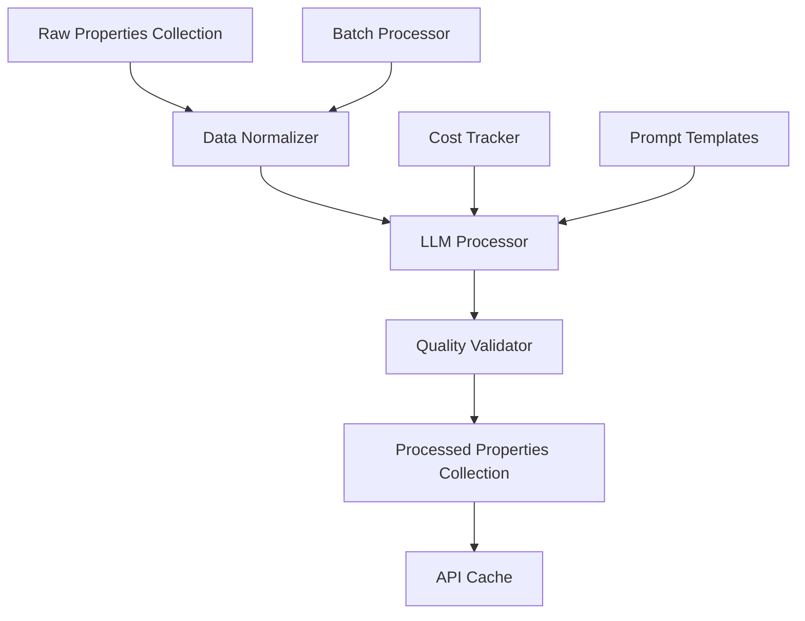

# Task 06: LLM Data Processing - Implementation Workflow
*Created: January 23, 2025*

## Overview
Task 6 implements the LLM processing pipeline that transforms raw property data from Maricopa API and Phoenix MLS into enriched, investment-ready information.

## Current System State
- **MongoDB**: ✅ Running with raw_properties collection populated
- **Collection Pipeline**: ✅ Operational (Tasks 1-5 complete)
- **Processing Pipeline**: 🔄 Ready to implement (Task 6)
- **Budget Available**: ~$10/month for LLM API costs

## Architecture Design

### Component Structure
```
phoenix_real_estate/processors/
├── __init__.py
├── base_processor.py          # Abstract base class
├── llm_processor.py           # Main LLM integration
├── data_normalizer.py         # Source harmonization
├── prompt_templates.py        # LLM prompt management
├── quality_validator.py       # Output validation
├── cost_tracker.py           # Budget monitoring
└── batch_processor.py        # Queue management
```

### Data Flow


## Implementation Plan

### Phase 1: Data Normalization (Day 1)
Harmonize data from different sources into consistent format.

```python
class DataNormalizer:
    """Normalizes property data from various sources."""
    
    def normalize_property(self, raw_data: dict) -> NormalizedProperty:
        """Convert raw data to standardized format."""
        source = raw_data.get('source')
        
        if source == 'maricopa_api':
            return self._normalize_maricopa(raw_data)
        elif source == 'phoenix_mls':
            return self._normalize_mls(raw_data)
        else:
            raise ValueError(f"Unknown source: {source}")
    
    def _normalize_address(self, address_str: str) -> Address:
        """Parse and standardize addresses."""
        # Handle variations like:
        # "123 Main St Phoenix AZ 85031"
        # "123 MAIN STREET, PHOENIX, AZ 85031"
        # "123 Main St Unit 4B Phoenix Arizona 85031"
```

### Phase 2: LLM Integration (Day 2)
Implement core LLM processing with multiple providers.

```python
class LLMProcessor:
    """Processes properties using LLM for enrichment."""
    
    def __init__(self, provider: str = 'openai'):
        self.provider = self._init_provider(provider)
        self.cost_tracker = CostTracker()
        self.templates = PromptTemplates()
    
    async def process_property(self, normalized: NormalizedProperty) -> EnrichedProperty:
        """Enrich property with LLM-generated content."""
        
        # 1. Generate compelling description
        description = await self._generate_description(normalized)
        
        # 2. Extract key features
        features = await self._extract_features(normalized)
        
        # 3. Investment analysis
        analysis = await self._analyze_investment(normalized)
        
        # 4. Track costs
        self.cost_tracker.record_usage(
            tokens=description.tokens + features.tokens + analysis.tokens,
            cost=description.cost + features.cost + analysis.cost
        )
        
        return EnrichedProperty(
            description=description.text,
            features=features.items,
            investment_analysis=analysis.data,
            metadata={
                'llm_model': self.provider.model,
                'tokens_used': total_tokens,
                'processing_cost': total_cost
            }
        )
```

### Phase 3: Prompt Engineering (Day 2-3)
Design effective prompts for different property types.

```python
class PromptTemplates:
    """Manages LLM prompts for property processing."""
    
    DESCRIPTION_TEMPLATE = """
    Create a compelling property description for the following real estate listing.
    Focus on key selling points and neighborhood benefits.
    
    Property Details:
    - Address: {address}
    - Type: {property_type}
    - Bedrooms: {bedrooms}
    - Bathrooms: {bathrooms}
    - Square Feet: {square_feet}
    - Lot Size: {lot_size} sq ft
    - Year Built: {year_built}
    - Price: ${price:,}
    
    Additional Context:
    - Neighborhood: {neighborhood}
    - School District: {school_district}
    - Recent Updates: {updates}
    
    Generate a 2-3 paragraph description that would appeal to:
    1. First-time homebuyers
    2. Investors looking for rental properties
    3. Families seeking good schools
    
    Tone: Professional but warm, emphasizing value and potential.
    """
    
    FEATURE_EXTRACTION_TEMPLATE = """
    Extract the top 5-8 key features from this property data.
    Focus on features that add value or appeal to buyers.
    
    {property_details}
    
    Return as a JSON list of features, each with:
    - feature: brief description (max 10 words)
    - category: interior|exterior|location|community
    - appeal: buyers|investors|families
    """
    
    INVESTMENT_ANALYSIS_TEMPLATE = """
    Analyze this property as an investment opportunity.
    
    Property: {property_details}
    Market Data:
    - Median rent for area: ${median_rent}
    - Average price/sqft: ${price_per_sqft}
    - Appreciation rate: {appreciation_rate}%
    
    Provide:
    1. Estimated monthly rental income
    2. Cap rate calculation
    3. Cash flow estimate (assume 20% down, 6.5% interest)
    4. Investment recommendation: strong buy|buy|hold|pass
    5. Key risks and opportunities (2-3 each)
    
    Format as JSON with clear reasoning.
    """
```

### Phase 4: Quality Validation (Day 3)
Ensure LLM outputs meet quality standards.

```python
class QualityValidator:
    """Validates LLM-generated content quality."""
    
    def validate_property(self, enriched: EnrichedProperty) -> QualityScore:
        """Score property enrichment quality."""
        
        scores = {
            'description_quality': self._score_description(enriched.description),
            'feature_relevance': self._score_features(enriched.features),
            'analysis_accuracy': self._score_analysis(enriched.investment_analysis),
            'completeness': self._score_completeness(enriched),
            'readability': self._score_readability(enriched.description)
        }
        
        # Flag for manual review if quality too low
        overall_score = sum(scores.values()) / len(scores)
        if overall_score < 0.7:
            enriched.needs_review = True
            enriched.review_reasons = self._get_review_reasons(scores)
        
        return QualityScore(
            overall=overall_score,
            components=scores,
            passed=overall_score >= 0.7
        )
```

### Phase 5: Batch Processing (Day 4)
Implement efficient batch processing with cost controls.

```python
class BatchProcessor:
    """Manages batch processing of properties."""
    
    def __init__(self, daily_budget: float = 10.0):
        self.processor = LLMProcessor()
        self.daily_budget = daily_budget
        self.daily_cost = 0.0
        
    async def process_batch(self, batch_size: int = 50):
        """Process a batch of properties."""
        
        # Get pending properties
        pending = await self.db.get_pending_properties(limit=batch_size)
        
        for property in pending:
            # Check budget
            if self.daily_cost >= self.daily_budget:
                logger.warning(f"Daily budget ${self.daily_budget} reached")
                break
            
            try:
                # Process property
                normalized = self.normalizer.normalize(property)
                enriched = await self.processor.process_property(normalized)
                validated = self.validator.validate(enriched)
                
                # Save results
                await self.db.save_processed_property(enriched)
                
                # Update costs
                self.daily_cost += enriched.metadata['processing_cost']
                
            except Exception as e:
                logger.error(f"Failed to process {property['_id']}: {e}")
                await self.db.mark_failed(property['_id'], str(e))
```

## Testing Strategy

### Unit Tests
```python
# tests/processors/test_data_normalizer.py
def test_normalize_maricopa_address():
    """Test Maricopa address normalization."""
    raw = {
        'source': 'maricopa_api',
        'data': {
            'address': '123 MAIN ST PHOENIX AZ 85031'
        }
    }
    
    normalized = normalizer.normalize_property(raw)
    
    assert normalized.address.street == '123 Main St'
    assert normalized.address.city == 'Phoenix'
    assert normalized.address.state == 'AZ'
    assert normalized.address.zip == '85031'

# tests/processors/test_llm_processor.py
@pytest.mark.asyncio
async def test_generate_description():
    """Test description generation."""
    mock_llm = Mock()
    mock_llm.complete.return_value = "Beautiful 3-bedroom home..."
    
    processor = LLMProcessor(provider=mock_llm)
    description = await processor._generate_description(sample_property)
    
    assert len(description.text) > 100
    assert 'bedroom' in description.text.lower()
```

### Integration Tests
```python
# tests/integration/test_processing_pipeline.py
@pytest.mark.integration
async def test_full_processing_pipeline():
    """Test complete processing pipeline."""
    # Insert test property
    raw_property = create_test_property()
    await db.insert_raw_property(raw_property)
    
    # Process
    processor = BatchProcessor()
    await processor.process_batch(batch_size=1)
    
    # Verify
    processed = await db.get_processed_property(raw_property['_id'])
    assert processed is not None
    assert processed['quality_score'] >= 0.7
    assert 'description' in processed['llm_enrichment']
```

## Cost Management

### Budget Tracking
```python
class CostTracker:
    """Tracks LLM API costs."""
    
    def __init__(self, daily_limit: float = 10.0):
        self.daily_limit = daily_limit
        self.costs = defaultdict(float)
        
    def record_usage(self, tokens: int, cost: float):
        """Record token usage and cost."""
        today = datetime.now().date()
        self.costs[today] += cost
        
        if self.costs[today] > self.daily_limit:
            raise BudgetExceededException(
                f"Daily budget ${self.daily_limit} exceeded: ${self.costs[today]:.2f}"
            )
    
    def get_daily_summary(self, date: date) -> dict:
        """Get cost summary for a date."""
        return {
            'date': date,
            'total_cost': self.costs[date],
            'budget_remaining': self.daily_limit - self.costs[date],
            'properties_processed': self._get_property_count(date)
        }
```

### Cost Optimization Strategies
1. **Caching**: Cache similar property descriptions
2. **Batching**: Process similar properties together
3. **Model Selection**: Use cheaper models for simple tasks
4. **Prompt Optimization**: Minimize token usage in prompts
5. **Quality Thresholds**: Skip enhancement for low-value properties

## Deployment Configuration

### Environment Variables
```bash
# LLM Provider Settings
LLM_PROVIDER=openai  # or anthropic, cohere, local
OPENAI_API_KEY=sk-...
LLM_MODEL=gpt-3.5-turbo  # or gpt-4 for better quality
LLM_TEMPERATURE=0.7
LLM_MAX_TOKENS=500

# Cost Management
DAILY_LLM_BUDGET=10.0
COST_PER_1K_TOKENS=0.002
ENABLE_CACHING=true
CACHE_TTL_HOURS=24

# Processing Settings
BATCH_SIZE=50
PROCESSING_INTERVAL_MINUTES=30
QUALITY_THRESHOLD=0.7
ENABLE_MANUAL_REVIEW=true
```

### Docker Configuration
```dockerfile
# Dockerfile.processor
FROM python:3.11-slim

WORKDIR /app

COPY requirements.txt .
RUN pip install -r requirements.txt

COPY phoenix_real_estate/processors ./processors
COPY phoenix_real_estate/models ./models

CMD ["python", "-m", "processors.batch_processor"]
```

## Monitoring & Alerts

### Key Metrics
```python
# Prometheus metrics
llm_requests_total = Counter('llm_requests_total', 'Total LLM API requests')
llm_tokens_used = Counter('llm_tokens_used', 'Total tokens consumed')
llm_costs_dollars = Counter('llm_costs_dollars', 'Total costs in dollars')
processing_errors = Counter('processing_errors', 'Processing failures')
quality_scores = Histogram('quality_scores', 'Distribution of quality scores')
```

### Alert Rules
```yaml
# alerts.yml
- alert: HighLLMCosts
  expr: rate(llm_costs_dollars[1h]) > 1.0
  annotations:
    summary: "LLM costs exceeding $1/hour"
    
- alert: LowQualityScores
  expr: avg(quality_scores) < 0.7
  annotations:
    summary: "Average quality score below threshold"
    
- alert: ProcessingBacklog
  expr: pending_properties > 1000
  annotations:
    summary: "Large backlog of unprocessed properties"
```

## Next Steps After Task 6

### Immediate
1. Deploy and monitor initial processing
2. Tune prompts based on quality scores
3. Optimize costs through caching
4. Set up monitoring dashboards

### Future Enhancements
1. **Multi-model Support**: Compare outputs from different LLMs
2. **Fine-tuning**: Train custom model on successful descriptions
3. **Market Intelligence**: Add comparative market analysis
4. **Image Analysis**: Process property photos with vision models
5. **Automated Valuation**: Build ML model for price predictions

## Success Criteria

### Technical Metrics
- [ ] Process 100+ properties/day within budget
- [ ] Achieve 85%+ average quality score
- [ ] Keep processing costs under $10/day
- [ ] Maintain <5% error rate
- [ ] Process each property in <5 seconds

### Business Metrics
- [ ] Generate compelling descriptions for 90%+ properties
- [ ] Accurate rental estimates (±10% of market)
- [ ] Identify investment opportunities with 70%+ accuracy
- [ ] Reduce manual review needs to <10%

### Quality Metrics
- [ ] Descriptions pass readability tests
- [ ] Features are relevant and valuable
- [ ] Investment analysis is data-driven
- [ ] No hallucinated information
- [ ] Consistent formatting

---
*This workflow guide provides the complete implementation plan for Task 6: LLM Data Processing*