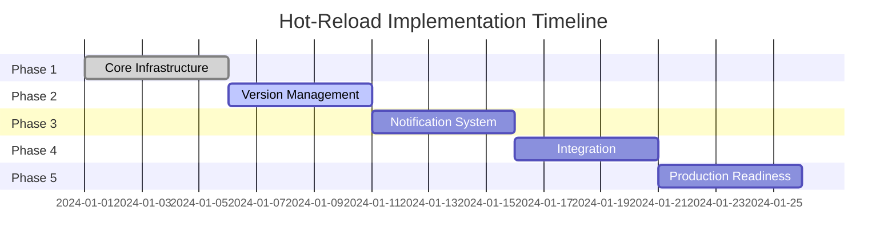

# Hot-Reload Implementation Roadmap

## Overview

This document provides a detailed implementation roadmap for the Phoenix Real Estate hot-reload configuration system. The implementation is divided into 5 phases over 5 weeks, with clear milestones and deliverables.

## Phase Timeline



## Phase 1: Core Infrastructure (Week 1)

### Goals
- Establish foundation for hot-reload system
- Implement file watching and change detection
- Create thread-safe configuration storage
- Build basic validation framework

### Tasks

#### Day 1-2: File Watcher Implementation
```python
# src/phoenix_real_estate/foundation/config/hot_reload/watcher.py

class HotReloadWatcher:
    """File system watcher for configuration changes."""
    
    def __init__(self, paths: List[Path], callback: Callable):
        self.observer = Observer()
        self.handler = ConfigFileHandler(callback)
        self.debouncer = Debouncer(delay_ms=100)
    
    def start(self):
        """Start watching for file changes."""
    
    def stop(self):
        """Stop watching for file changes."""

class ConfigFileHandler(FileSystemEventHandler):
    """Handle file system events for config files."""
    
    def on_modified(self, event):
        """Handle file modification."""
    
    def on_created(self, event):
        """Handle file creation."""
```

**Deliverables:**
- [ ] Implement `HotReloadWatcher` class
- [ ] Add support for .yaml, .env, .env.* files
- [ ] Implement debouncing for rapid changes
- [ ] Add filtering for temporary files
- [ ] Write unit tests for file watching

#### Day 2-3: Atomic Configuration Store
```python
# src/phoenix_real_estate/foundation/config/hot_reload/store.py

class AtomicConfigStore:
    """Thread-safe configuration storage."""
    
    def __init__(self):
        self._config = {}
        self._lock = threading.RLock()
        self._version = 0
    
    def get(self, key: str, default: Any = None) -> Any:
        """Thread-safe configuration retrieval."""
    
    def update(self, updates: Dict[str, Any]) -> int:
        """Atomic configuration update."""
    
    def snapshot(self) -> Tuple[Dict[str, Any], int]:
        """Get consistent snapshot of configuration."""
```

**Deliverables:**
- [ ] Implement thread-safe storage with RLock
- [ ] Add atomic update operations
- [ ] Implement copy-on-write for efficiency
- [ ] Add configuration versioning
- [ ] Write concurrency tests

#### Day 3-4: Basic Validation Framework
```python
# src/phoenix_real_estate/foundation/config/hot_reload/validator.py

class ConfigChangeValidator:
    """Validate configuration changes before applying."""
    
    def validate(self, changes: List[ConfigChange]) -> ValidationResult:
        """Run validation pipeline on changes."""
    
    def add_validator(self, validator: Callable) -> None:
        """Add custom validator to pipeline."""
```

**Deliverables:**
- [ ] Implement validation pipeline
- [ ] Add type validation
- [ ] Add range validation
- [ ] Add dependency validation
- [ ] Write validation tests

#### Day 4-5: Change Queue Implementation
```python
# src/phoenix_real_estate/foundation/config/hot_reload/queue.py

class ConfigChangeQueue:
    """Queue for managing configuration changes."""
    
    def __init__(self, max_size: int = 1000):
        self.queue = PriorityQueue(maxsize=max_size)
        self.processing = threading.Event()
    
    def enqueue(self, change: ConfigChange, priority: Priority) -> None:
        """Add change to queue."""
    
    def process_batch(self, max_items: int = 10) -> List[ConfigChange]:
        """Process batch of changes."""
```

**Deliverables:**
- [ ] Implement priority queue for changes
- [ ] Add change coalescing logic
- [ ] Implement batch processing
- [ ] Add overflow handling
- [ ] Write queue tests

### Phase 1 Milestones
- [ ] All core components implemented
- [ ] Unit test coverage > 90%
- [ ] Basic integration test passing
- [ ] Documentation for core components

## Phase 2: Version Management (Week 2)

### Goals
- Implement configuration versioning
- Add rollback capability
- Create version diff functionality
- Build version persistence

### Tasks

#### Day 1-2: Version Manager Implementation
```python
# src/phoenix_real_estate/foundation/config/hot_reload/version.py

class ConfigVersionManager:
    """Manage configuration versions."""
    
    def __init__(self, max_versions: int = 10):
        self.versions = deque(maxlen=max_versions)
        self.current_version = None
    
    def create_version(self, config: Dict) -> ConfigVersion:
        """Create new configuration version."""
    
    def rollback(self, version_id: str) -> ConfigVersion:
        """Rollback to specific version."""
```

**Deliverables:**
- [ ] Implement version storage with deque
- [ ] Add version creation logic
- [ ] Implement version pruning
- [ ] Add version metadata support
- [ ] Write version management tests

#### Day 2-3: Rollback Functionality
```python
class RollbackManager:
    """Handle configuration rollbacks."""
    
    def rollback_to_version(self, version: ConfigVersion) -> RollbackResult:
        """Rollback to specific version."""
    
    def rollback_steps(self, steps: int) -> RollbackResult:
        """Rollback by number of steps."""
```

**Deliverables:**
- [ ] Implement safe rollback logic
- [ ] Add validation before rollback
- [ ] Implement rollback notifications
- [ ] Add rollback history
- [ ] Write rollback tests

#### Day 3-4: Version Diff Implementation
```python
class VersionDiffer:
    """Calculate differences between versions."""
    
    def diff(self, v1: ConfigVersion, v2: ConfigVersion) -> VersionDiff:
        """Calculate diff between versions."""
    
    def format_diff(self, diff: VersionDiff) -> str:
        """Format diff for display."""
```

**Deliverables:**
- [ ] Implement recursive diff algorithm
- [ ] Add change categorization
- [ ] Implement diff formatting
- [ ] Add diff statistics
- [ ] Write diff tests

#### Day 4-5: Version Persistence (Optional)
```python
class VersionPersistence:
    """Persist versions to disk."""
    
    def save_version(self, version: ConfigVersion) -> None:
        """Save version to disk."""
    
    def load_versions(self) -> List[ConfigVersion]:
        """Load versions from disk."""
```

**Deliverables:**
- [ ] Implement JSON/YAML persistence
- [ ] Add version compression
- [ ] Implement cleanup strategy
- [ ] Add corruption recovery
- [ ] Write persistence tests

### Phase 2 Milestones
- [ ] Version management fully functional
- [ ] Rollback working with validation
- [ ] Diff functionality complete
- [ ] Integration tests passing

## Phase 3: Notification System (Week 3)

### Goals
- Implement subscriber pattern
- Add filtered subscriptions
- Build async notification support
- Create notification batching

### Tasks

#### Day 1-2: Subscriber Pattern Implementation
```python
# src/phoenix_real_estate/foundation/config/hot_reload/notifier.py

class ConfigChangeNotifier:
    """Notify subscribers of configuration changes."""
    
    def __init__(self):
        self.subscribers = defaultdict(list)
        self.executor = ThreadPoolExecutor(max_workers=5)
    
    def subscribe(self, pattern: str, subscriber: ConfigSubscriber) -> Handle:
        """Subscribe to configuration changes."""
    
    def notify(self, change: ConfigChange) -> NotificationResult:
        """Notify relevant subscribers."""
```

**Deliverables:**
- [ ] Implement subscriber registry
- [ ] Add pattern matching for paths
- [ ] Implement notification dispatch
- [ ] Add error handling
- [ ] Write subscriber tests

#### Day 2-3: Filtered Subscriptions
```python
class SubscriptionFilter:
    """Filter subscriptions by pattern."""
    
    def matches(self, pattern: str, path: str) -> bool:
        """Check if path matches pattern."""
    
    def get_subscribers(self, path: str) -> List[ConfigSubscriber]:
        """Get subscribers for path."""
```

**Deliverables:**
- [ ] Implement glob pattern matching
- [ ] Add regex pattern support
- [ ] Implement path hierarchy matching
- [ ] Add subscription priorities
- [ ] Write filter tests

#### Day 3-4: Async Notification Support
```python
class AsyncNotifier:
    """Asynchronous notification dispatcher."""
    
    async def notify_async(self, change: ConfigChange) -> None:
        """Notify subscribers asynchronously."""
    
    async def notify_batch_async(self, changes: List[ConfigChange]) -> None:
        """Notify batch of changes asynchronously."""
```

**Deliverables:**
- [ ] Implement async notification
- [ ] Add timeout handling
- [ ] Implement retry logic
- [ ] Add backpressure handling
- [ ] Write async tests

#### Day 4-5: Notification Batching
```python
class NotificationBatcher:
    """Batch notifications for efficiency."""
    
    def add_change(self, change: ConfigChange) -> None:
        """Add change to batch."""
    
    def flush(self) -> List[ConfigChange]:
        """Flush pending notifications."""
```

**Deliverables:**
- [ ] Implement batching logic
- [ ] Add time-based flushing
- [ ] Add size-based flushing
- [ ] Implement batch optimization
- [ ] Write batching tests

### Phase 3 Milestones
- [ ] Subscriber pattern fully implemented
- [ ] Async notifications working
- [ ] Batching operational
- [ ] Performance tests passing

## Phase 4: Integration (Week 4)

### Goals
- Integrate with existing ConfigProvider
- Create HotReloadableConfigProvider
- Add component hot-reload support
- Build development tools

### Tasks

#### Day 1-2: ConfigProvider Integration
```python
# src/phoenix_real_estate/foundation/config/hot_reload/provider.py

class HotReloadableConfigProvider(EnvironmentConfigProvider):
    """Configuration provider with hot-reload support."""
    
    def __init__(self, *args, enable_hot_reload: bool = None, **kwargs):
        super().__init__(*args, **kwargs)
        self.hot_reload = HotReloadManager(self)
    
    def _on_file_change(self, path: Path) -> None:
        """Handle configuration file changes."""
```

**Deliverables:**
- [ ] Extend EnvironmentConfigProvider
- [ ] Integrate HotReloadManager
- [ ] Override key methods for hot-reload
- [ ] Add backward compatibility
- [ ] Write integration tests

#### Day 2-3: Component Integration
```python
# Examples of hot-reloadable components

class HotReloadableDatabase:
    """Database with hot-reload support."""
    
class HotReloadableLogger:
    """Logger with hot-reload support."""
    
class HotReloadableRateLimiter:
    """Rate limiter with hot-reload support."""
```

**Deliverables:**
- [ ] Create hot-reloadable database config
- [ ] Create hot-reloadable logging config
- [ ] Create hot-reloadable rate limiter
- [ ] Add more component examples
- [ ] Write component tests

#### Day 3-4: Development Tools
```python
# src/phoenix_real_estate/foundation/config/hot_reload/tools.py

class HotReloadCLI:
    """CLI tools for hot-reload management."""
    
    def status(self) -> None:
        """Show hot-reload status."""
    
    def reload(self) -> None:
        """Force configuration reload."""
    
    def rollback(self, version: str) -> None:
        """Rollback configuration."""
```

**Deliverables:**
- [ ] Implement CLI commands
- [ ] Add status dashboard
- [ ] Create reload triggers
- [ ] Add debugging tools
- [ ] Write tool documentation

#### Day 4-5: Migration Guide
**Deliverables:**
- [ ] Create migration guide
- [ ] Document API changes
- [ ] Add code examples
- [ ] Create troubleshooting guide
- [ ] Update main documentation

### Phase 4 Milestones
- [ ] Full integration complete
- [ ] All components hot-reloadable
- [ ] Development tools functional
- [ ] Documentation complete

## Phase 5: Production Readiness (Week 5)

### Goals
- Add performance monitoring
- Implement safety features
- Complete testing suite
- Optimize performance

### Tasks

#### Day 1-2: Performance Monitoring
```python
# src/phoenix_real_estate/foundation/config/hot_reload/metrics.py

class HotReloadMetrics:
    """Collect and report hot-reload metrics."""
    
    def record_reload(self, duration: float, changes: int) -> None:
        """Record reload metrics."""
    
    def get_stats(self) -> Dict[str, Any]:
        """Get performance statistics."""
```

**Deliverables:**
- [ ] Implement metrics collection
- [ ] Add performance counters
- [ ] Create metrics dashboard
- [ ] Add alerting thresholds
- [ ] Write metrics tests

#### Day 2-3: Safety Features
```python
class HotReloadSafety:
    """Safety features for hot-reload."""
    
    def check_environment(self) -> bool:
        """Verify safe to hot-reload."""
    
    def add_circuit_breaker(self) -> None:
        """Add circuit breaker for failures."""
```

**Deliverables:**
- [ ] Implement production safeguard
- [ ] Add circuit breaker
- [ ] Implement rate limiting
- [ ] Add emergency disable
- [ ] Write safety tests

#### Day 3-4: Comprehensive Testing
**Deliverables:**
- [ ] Complete unit test suite (>95% coverage)
- [ ] Add integration test suite
- [ ] Create performance test suite
- [ ] Add stress testing
- [ ] Document test scenarios

#### Day 4-5: Performance Optimization
**Deliverables:**
- [ ] Profile hot-reload performance
- [ ] Optimize critical paths
- [ ] Reduce memory usage
- [ ] Optimize notification dispatch
- [ ] Create performance report

### Phase 5 Milestones
- [ ] Performance metrics < 1% overhead
- [ ] All safety features implemented
- [ ] Test coverage > 95%
- [ ] Production ready

## Risk Mitigation

### Technical Risks
1. **File System Events**: Some systems may not support all file events
   - Mitigation: Implement polling fallback
   
2. **Thread Safety**: Complex concurrent access patterns
   - Mitigation: Extensive concurrency testing
   
3. **Memory Leaks**: Version history and subscriptions
   - Mitigation: Implement proper cleanup and limits

### Schedule Risks
1. **Integration Complexity**: May take longer than expected
   - Mitigation: Start integration early, parallel work
   
2. **Testing Time**: Comprehensive testing needs time
   - Mitigation: Automated testing, CI/CD integration

## Success Criteria

### Functional Requirements
- [ ] Zero-downtime configuration updates
- [ ] < 100ms reload time for typical changes
- [ ] Rollback capability within 1 second
- [ ] 100% backward compatibility

### Performance Requirements
- [ ] < 1% CPU overhead when enabled
- [ ] < 1MB memory overhead base
- [ ] < 100KB per version stored
- [ ] < 10ms notification latency

### Quality Requirements
- [ ] > 95% test coverage
- [ ] Zero critical security issues
- [ ] Comprehensive documentation
- [ ] Production-ready safety features

## Conclusion

This roadmap provides a structured approach to implementing the hot-reload configuration system. Each phase builds on the previous one, ensuring a solid foundation and comprehensive feature set. The implementation can be adjusted based on priorities and resources, but following this roadmap will result in a robust, production-ready hot-reload system.