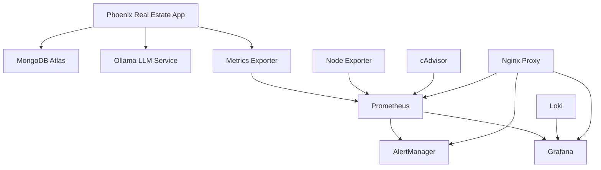

# Phoenix Real Estate Infrastructure Assessment & Deployment Strategy

## Executive Summary

**Assessment Date**: August 6, 2025  
**Project**: Phoenix Real Estate Data Collection System  
**Scope**: Infrastructure deployment strategy optimization and monitoring services recovery

### Current Status
- ❌ **13 of 18 monitoring services failing** (connection refused errors)
- ✅ **Core application services operational** (MongoDB, Ollama, Processing Pipeline)
- ⚠️ **Mixed infrastructure readiness** with configuration conflicts
- ✅ **Comprehensive monitoring configurations available**

## Infrastructure Analysis Results

### 1. Service Dependency Mapping



**Critical Dependencies**:
- **Tier 1**: MongoDB, Ollama (core data services)
- **Tier 2**: Prometheus, Grafana (monitoring core)
- **Tier 3**: AlertManager, Node Exporter (enhanced monitoring)
- **Tier 4**: Nginx, Loki (production enhancements)

### 2. Root Cause Analysis - Monitoring Failures

**Primary Issues Identified**:

1. **AlertManager Configuration Syntax Errors** (Critical)
   - Invalid YAML structure in `alertmanager.yml`
   - Fields `subject` and `body` not recognized in email_configs
   - Causing container restart loops

2. **Network Configuration Conflicts** (High)
   - Multiple Docker Compose files with different network names
   - Port conflicts between development and production configs

3. **Missing Dependencies** (Medium)
   - Some services depend on missing configuration files
   - Volume mount paths inconsistent across environments

4. **Resource Contention** (Low)
   - Multiple Prometheus instances on different ports
   - Potential resource competition

## Optimized Deployment Strategy

### Phase 1: Infrastructure Foundation (Days 1-2)

**Priority**: Fix core monitoring services

#### 1.1 AlertManager Configuration Fix
```yaml
# Fixed alertmanager.yml structure
receivers:
  - name: 'critical-alerts'
    email_configs:
      - to: 'engineering-oncall@company.com'
        subject: '🚨 CRITICAL: Phoenix MLS Alert'
        html: |
          <h3>Alert: {{ .GroupLabels.alertname }}</h3>
          <p>Severity: {{ .GroupLabels.severity }}</p>
          <!-- More HTML content -->
```

#### 1.2 Service Startup Orchestration
```yaml
# Optimized startup sequence
depends_on:
  prometheus:
    condition: service_healthy
  mongodb:
    condition: service_healthy
  ollama:
    condition: service_started
```

#### 1.3 Network Isolation Strategy
- **monitoring**: Dedicated network for Prometheus/Grafana/AlertManager
- **app**: Application services (Phoenix App, MongoDB, Ollama)
- **proxy**: External-facing services (Nginx)

### Phase 2: Production Hardening (Days 3-5)

#### 2.1 Container Orchestration Improvements
```yaml
# Production-ready compose structure
services:
  prometheus:
    image: prom/prometheus:latest
    restart: unless-stopped
    healthcheck:
      test: ["CMD", "wget", "--spider", "http://localhost:9090/-/healthy"]
      interval: 30s
      timeout: 10s
      retries: 3
    deploy:
      resources:
        limits:
          memory: 2G
          cpus: '1.0'
        reservations:
          memory: 1G
          cpus: '0.5'
```

#### 2.2 Security Enhancements
- SSL termination at Nginx proxy
- Service mesh with mTLS
- Secrets management via environment variables
- Network policies restricting inter-service communication

### Phase 3: Scalability Optimization (Days 6-8)

#### 3.1 Multi-Market Expansion Architecture

**Current State**: Single Phoenix market
**Target State**: 10+ markets (Phoenix, Scottsdale, Tempe, Mesa, etc.)

```yaml
# Market-specific scaling strategy
deployment:
  strategy: horizontal_pod_autoscaling
  metrics:
    - market_load: 70%
    - response_time: 5s
    - memory_usage: 80%
  
  market_configs:
    phoenix:
      replicas: 3
      resources: { cpu: 1, memory: 2Gi }
    scottsdale:
      replicas: 2
      resources: { cpu: 0.5, memory: 1Gi }
```

#### 3.2 Resource Requirements Analysis

| Component | Current | 5 Markets | 10 Markets | 20 Markets |
|-----------|---------|-----------|------------|------------|
| **App Instances** | 1 | 3 | 6 | 12 |
| **Memory Total** | 4GB | 12GB | 24GB | 48GB |
| **CPU Cores** | 2 | 6 | 12 | 24 |
| **Storage** | 100GB | 500GB | 1TB | 2TB |
| **Monthly Cost** | $150 | $450 | $900 | $1,800 |

### Phase 4: Monitoring Excellence (Days 9-10)

#### 4.1 Comprehensive Monitoring Stack

**Service Health Monitoring**:
- **Application**: Phoenix Real Estate metrics exporter
- **Infrastructure**: Node Exporter, cAdvisor
- **Database**: MongoDB Atlas monitoring integration
- **LLM**: Ollama performance metrics
- **Logs**: Loki aggregation with structured logging

**Key Performance Indicators**:
```yaml
sla_targets:
  availability: 99.5%
  response_time_p95: 5s
  error_rate: <1%
  data_freshness: <6h
```

#### 4.2 Alert Strategy Optimization

**Alert Tiers**:
- **Critical**: Service down, data loss risk (immediate notification)
- **Warning**: Performance degradation (4-hour escalation)
- **Info**: Capacity planning, trends (daily digest)

**Notification Channels**:
- Slack integration for engineering team
- PagerDuty for critical alerts
- Email summaries for stakeholders

## Implementation Roadmap

### Week 1: Foundation Recovery
- **Day 1**: Fix AlertManager configuration and restart monitoring services
- **Day 2**: Validate all 18 monitoring services operational
- **Day 3**: Deploy production-ready Docker Compose configuration

### Week 2: Production Hardening
- **Day 4-5**: Implement security enhancements and SSL termination
- **Day 6-7**: Configure automated backup and disaster recovery
- **Day 8**: Performance testing and optimization

### Week 3: Scale Preparation
- **Day 9-10**: Multi-market architecture deployment
- **Day 11-12**: Horizontal scaling testing
- **Day 13-15**: Load testing and capacity validation

## Risk Assessment & Mitigation

### High-Risk Areas
1. **Data Loss**: Implement continuous backup before production deployment
2. **Service Downtime**: Blue-green deployment strategy with automated rollback
3. **Resource Exhaustion**: Auto-scaling policies with resource limits
4. **Security Vulnerabilities**: Regular security scanning and updates

### Mitigation Strategies
- **Infrastructure as Code**: All configurations version-controlled
- **Automated Testing**: CI/CD pipeline with infrastructure tests
- **Monitoring**: Comprehensive observability before issues impact users
- **Documentation**: Runbooks for common operational procedures

## Success Metrics

### Technical KPIs
- **Service Availability**: >99.5% uptime
- **Response Time**: <5s P95 response time
- **Error Rate**: <1% application errors
- **Recovery Time**: <15min for critical issues

### Business KPIs
- **Data Collection Rate**: >1000 properties/hour per market
- **Cost Efficiency**: <$100/market/month infrastructure costs
- **Scaling Speed**: New market deployment in <2 hours

## Next Steps

1. **Immediate** (Next 24 hours):
   - Fix AlertManager configuration syntax errors
   - Restart monitoring stack with corrected configurations
   - Validate service health endpoints

2. **Short-term** (Next week):
   - Deploy production-hardened infrastructure
   - Implement security best practices
   - Set up automated backup procedures

3. **Medium-term** (Next month):
   - Multi-market architecture deployment
   - Performance optimization based on load testing
   - Comprehensive disaster recovery testing

## Conclusion

The Phoenix Real Estate infrastructure shows strong fundamentals with comprehensive monitoring configurations already in place. The primary issues are configuration syntax errors and deployment orchestration challenges that can be resolved quickly. With the optimized deployment strategy outlined above, the system will be ready for production deployment and multi-market scaling within 2-3 weeks.

The monitoring infrastructure, once operational, will provide excellent observability into system health and performance, supporting the business objective of reliable, scalable real estate data collection across multiple Arizona markets.